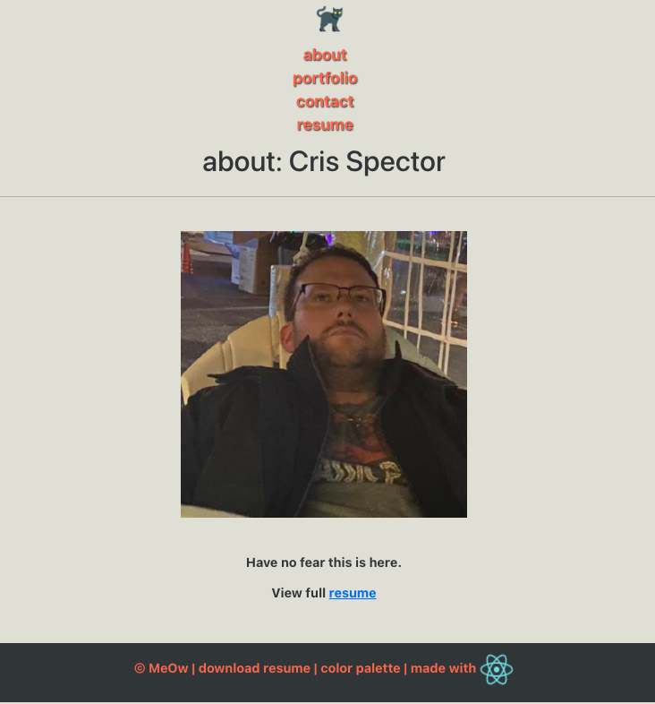

  # ReationPort2
  

  ## Description 
    * create a portfolio, using your new React skills to help set you apart from other developers whose portfolios don’t use the latest technologies.
  ## Table of Contents (Optional)
  
  * [Installation](#installation)
  * [Usage](#usage)
  * [Credits](#credits)
  * [License](#license)

  ## Installation
    * To install: npm install
  
  ## Usage 
    * Use this program by: use it
  
  
  
  
  ## Credits
   * The following folks helped with this project: me
  
  ## License
   * This project uses this license: https://opensource.org/licenses/MIT
  
  ## Badges
  
  * 
  
  ## Features
    * The project has the following features: react
  
  ## Contributing
    * If you'd contribute to this project, consider the following: contrib if you want 
  ## Tests
    *nah

  ## Questions?
  * Reach out to the repository owner spectocr, https://github.com/spectocr/ReationPort2, or email at cris.spector@live.com

